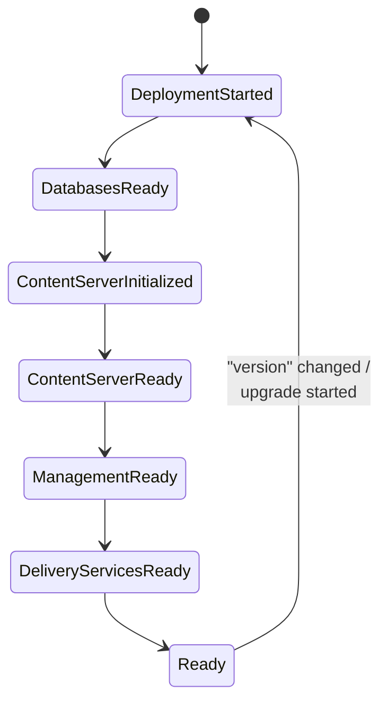
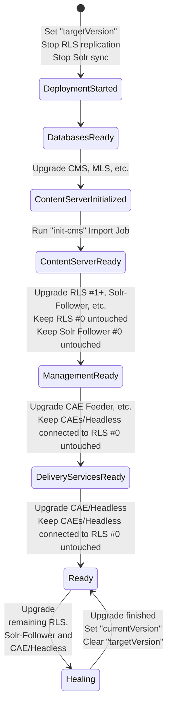

# Upgrade Path

The "Upgrade path" allows to apply the idea of versions to a complete CMCC system. Every new release then may 
contain a new version which is not just a deployment of all components with different images. 

Instead, the process of iterating all milestones is again started. Also, the "Zero-Downtime" approach makes sure 
that the frontend delivery keeps working throughout the whole upgrade process. 

## Versioning

The "Upgrade path" can be utilized by working with the "version" property. 

In the CMCC resource spec you need to set the version property to a non-empty value. It can have any format, there 
are no specific constraints. Still it is advisable to use a rather **short and simple** format as 
the (cleaned and simplified) version is being used as a suffix for the Solr follower services.

The currently (successfully) deployed version can always be found in the status of a CMCC resource (`currentVersion`). 

## The Upgrade Process in Detail

When a CMCC resource is deployed with a version property deviating from the `currentVersion` the following takes place:

 - In the status the property `targetVersion` is set to this new version
 - The Milestone is set back to "DeploymentStarted"
 - Start the whole process of iterating through all milestones until "Ready" is reached again. As the 
   Operator now works in "upgrade mode" it ensures the Zero-Downtime-Deployment (see below)
 - `currentVersion` is set and `targetVersion` is cleared when Milestone "Ready" is reached


(for this diagram to work in IntelliJ, install [this](https://www.jetbrains.com/guide/go/tips/mermaid-js-support-in-markdown/))

## Feeder "Generation"

Every feeder component has a field "generation" which denotes the idea of a version of the index structure. As soon as
this field changes the Operator will mark that Feeder to be reset / re-indexed.

That allows to distinguish between deployments the do / do NOT need a feeder reset. See [Best Practices](#best-practices) below.

## Zero-Downtime-Deployments

**Note:** This feature only works when working with at least 2 RLS instances and at least 2 CAE instances. See [Scaling](scaling.md) for details.

The general idea here is that at least one combination of Delivery Stacks (RLS + Solr-Follower + CAE/Headless) 
is kept running independently while all other parts of the CMCC system are upgraded to the new version. 
When the upgraded system is up again (including an upgraded Delivery Stack)

This includes:
 - Replication/Synchronization for all RLSs and Solr Followers is turned off right before the Milestone is set to "DeploymentStarted"
 - Re-importing new themes (and optionally test content)
 - Re-indexing feeders
 - Waiting for Replication/Synchronization before booting upgraded delivery threads (like CAEs)
 - Keeping one Delivery Stack untouched until all other components are upgraded and ready again

Workflow with additional Upgrade steps

(for this diagram to work in IntelliJ, install [this](https://www.jetbrains.com/guide/go/tips/mermaid-js-support-in-markdown/))

# Best Practices

## Keep current version by default

It has proven valuable to have your deployment pipeline jobs **keep the current version** by default. 

That avoids accidentally switching away from versioning (effectively disabling Upgrade-path) or re-deploying all 
components causing unwanted downtimes.

Approach:
 - In every deployment: Use the given version string OR determine the currently running version as a fallback

Example: The following script ensures that the env variable CMCC_VERSION always has such a "correct" value
```shell
  export CMCC_VERSION=${CMCC_VERSION:=$(kubectl get cmcc $RELEASE_NAME -n $NAMESPACE -o jsonpath="{.spec.version}")}
  echo CMCC_VERSION=${CMCC_VERSION}
```
Afterwards you can use that variable in the command line that is running your HELM deployment. This way you make sure
that **every deployment run** has a version.

Example:
```shell
helm upgrade --install my-release cmcc-operator/cmcc --values my-values.yaml --set cmcc-version=${CMCC_VERSION}
```

## Keep the feeder generation by default

This is the same idea as the "version" above. Make sure you keep the current generation value for all feeders unless
explicitly specified otherwise.

Example: The following script ensures that all Feeder Generation the env variables have a "correct" value
```shell
  - export STUDIO_FEEDER_GENERATION=${STUDIO_FEEDER_GENERATION:=$(kubectl get cmcc $RELEASE_NAME -n $NAMESPACE -o jsonpath="{.spec.components[?(@.type == 'content-feeder')].extra.generation}")}
  - echo STUDIO_FEEDER_GENERATION=${STUDIO_FEEDER_GENERATION}
  - export PREVIEW_FEEDER_GENERATION=${PREVIEW_FEEDER_GENERATION:=$(kubectl get cmcc $RELEASE_NAME -n $NAMESPACE -o jsonpath="{.spec}" | jq -r '.components[] | select(.type == "cae-feeder" and .kind == "preview" and .name != "bas-feeder") | .extra.generation // ""')}
  - echo PREVIEW_FEEDER_GENERATION=${PREVIEW_FEEDER_GENERATION}
  - export LIVE_FEEDER_GENERATION=${LIVE_FEEDER_GENERATION:=$(kubectl get cmcc $RELEASE_NAME -n $NAMESPACE -o jsonpath="{.spec}" | jq -r '.components[] | select(.type == "cae-feeder" and .kind == "live" and .name != "bas-feeder") | .extra.generation // ""')}
  - echo LIVE_FEEDER_GENERATION=${LIVE_FEEDER_GENERATION}
```
Afterwards you can use these variables in the command line that is running your HELM deployment. This way you make sure
that **every deployment run** has all the Feeder Generations set.

Example:
```shell
helm upgrade --install my-release cmcc-operator/cmcc --values my-values.yaml --set barmerCmcc.studioFeederGeneration=${STUDIO_FEEDER_GENERATION} --set barmerCmcc.previewFeederGeneration=${PREVIEW_FEEDER_GENERATION} --set barmerCmcc.basFeederGeneration=${LIVE_FEEDER_GENERATION}
```
